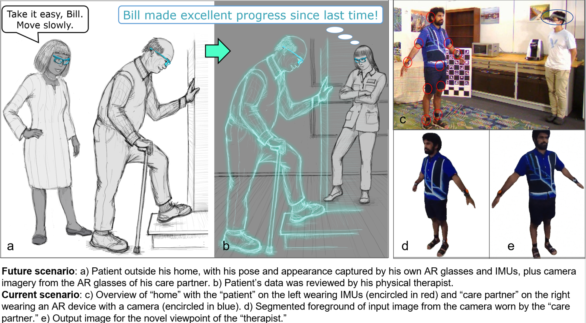

# Reconstruction of Human Body Pose and Appearance Using Body-Worn IMUs and a Nearby Camera View for Collaborative Egocentric Telepresence

## Introduction 

This is an official implementation of ***Reconstruction of Human Body Pose and Appearance Using Body-Worn IMUs and a Nearby Camera View for Collaborative Egocentric Telepresence***

> [***Reconstruction of Human Body Pose and Appearance Using Body-Worn IMUs and a Nearby Camera View for Collaborative Egocentric Telepresence***](https://drive.google.com/file/d/1yeIdI88bgQUoK7Gu_DQT-PWNd3iJyHx0)
> Qian Zhang, Akshay Paruchuri, YoungWoon Cha, Jiabin Huang, Jade Kandel, Howard Jiang, Adrian Ilie, Andrei State, Danielle Albers, Daniel Szafir, Henry Fuchs         
> *[IEEE VR 2023](https://ieeevr.org/2023/)      

## Code

Code will be availalbe soon.

## Acknowledgement 

## Citation

If you find this code useful , please cite our paper:

	@inproceedings{qian2023vr,
  		title={Reconstruction of Human Body Pose and Appearance Using Body-Worn IMUs and a Nearby Camera View for Collaborative Egocentric Telepresence},
  		author={Qian Zhang, Akshay Paruchuri, YoungWoon Cha, Jiabin Huang, Jade Kandel, Howard Jiang, Adrian Ilie, Andrei State, Danielle Albers, Daniel Szafir, Henry Fuchs},
  		booktitle={2023 IEEE Virtual Reality and 3D User Interfaces (VR)},
  		year={2023}
      organization={IEEE}
	}

Contact: qzane [at] cs.unc.edu
